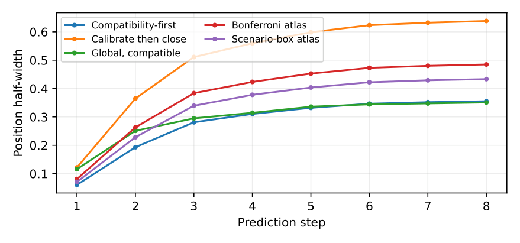
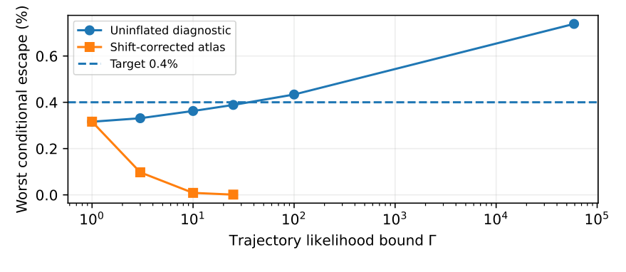

# Contextual Collective-Tube MPC

## Numerical reproducibility package

This repository accompanies **Giuseppe C. Calafiore, “Contextual Collective-Tube Model Predictive Control with Finite-Sample Safety Certificates.”** It reproduces Section 8 of the current 34-page manuscript, including all three tables and both figures.

The four numerical scripts in [`experiments/`](experiments/) are preserved byte-for-byte from the current manuscript package. The repository adds a command-line interface and independent verification tools. All disturbances are synthetic, and their complete generators and random-stream seeds are provided. No external dataset or commercial solver is required.

The exact manuscript and source-file fingerprints are recorded in [`reference/provenance.json`](reference/provenance.json). The experimental settings have been preserved. Reviewer correspondence and the full manuscript are excluded from this public-code package.

## Quick start

Use **CPython 3.13.5** for the tested configuration. From this repository's root, create a virtual environment and install the pinned requirements:

```bash
python3.13 -m venv .venv
source .venv/bin/activate
python -m pip install -r requirements.txt
```

On Windows, create the environment with `py -3.13 -m venv .venv` and activate it with `.venv\Scripts\Activate.ps1`. Subsequent commands are the same. Linux x86-64 is the locally tested platform; other platforms may introduce floating-point differences.

First check the archive and exercise the numerical pipeline:

```bash
python reproduce.py check-reference
python -m unittest discover -s tests -v
python reproduce.py smoke --output runs/smoke
```

Then reproduce **every reported experiment** with one command:

```bash
python reproduce.py run --study all --output runs/full
```

This command generates the synthetic samples, recalibrates the atlases, and simulates the missions. It also evaluates the feasible-state grid and regenerates the paper assets. It finishes by comparing the outputs with the archive and auditing the stored certificates and mission logs. A failed check produces a nonzero exit status.

Every run requires a fresh output directory, so existing results remain intact. The local full experiment took approximately two minutes before asset generation and validation; runtime depends on the machine. See [`validation/VALIDATION.md`](validation/VALIDATION.md) for measured runs and the limits of the environment checks.

The smoke test uses the full calibration counts with two four-step missions for each plant. It provides a quick installation check; it does not reproduce the paper's performance statistics.

## Outputs

A full run creates:

```text
runs/full/
  experiments/results/    Mission CSVs, atlas JSONs, and study summaries
  figures/                Two regenerated manuscript figures (PDF)
  tables/                 Three regenerated manuscript tables (LaTeX)
  environment.json        Package versions, numerical backend, and source hashes
  experiment.log          Complete simulation console log
  assets.log              Figure/table generation log
  verification.json       Comparison and independent-audit results
  run_status.json         Success/failure and elapsed time
```

The original outputs are in [`reference/results/`](reference/results/): **42 CSV files and 79 JSON files**, including the historical run manifest. Verification compares the 78 scientific JSON files; runtime/environment metadata are handled separately. The archive also contains the exact manuscript tables and figures.

To regenerate only the manuscript assets from archived results:

```bash
python reproduce.py assets --output runs/assets
```

To validate a previously generated full run, including exact CSV-byte comparison:

```bash
python reproduce.py verify --results runs/full/experiments/results \
  --exact-csv --report runs/full/verification-exact.json
```

The default numeric comparison uses absolute tolerance `2e-7` and relative tolerance `1e-8`. Discrete outcomes must match exactly. Timing fields are excluded. PDF metadata may change; plotting inputs and the original plotting code are preserved. Local rendered-image comparisons matched both figures pixel-for-pixel.

## Experiments covered

| Study | Content | Manuscript location |
|---|---|---|
| Benchmark A | Compatibility-first calibration and the calibrated-before-closure ablation; global and coordinatewise baselines | Section 8.2, Tables 1–2, Figure 1 |
| Data fairness and replication | Equal-total-data comparison and four independent full-calibration replications | Section 8.2 |
| Mixture diagnostic | Pooled calibration versus context-conditional escape rates | Section 8.2 |
| Budget operation | Context-dependent risk charges, greedy exhaustion, and reserve-based admission | Section 8.3 |
| Recovery stress test | Loss of measured-state feasibility while the state remains initially inside its constraints | Section 8.3 |
| Benchmark B | State/input-dependent deployment shift, including sample-rejected corrected designs | Section 8.4, Table 3, Figure 2 |

The main protocol uses 1,800 design and 50,000 calibration trajectories per context. Independent conditional tests use 80,000 trajectories per context. The main missions have 22 steps, with trajectory risk target `0.004`, confidence allowance `0.001`, and initial mission budget `0.1`. The confidence allowance applies separately to each method and experiment. Diagnostic variations are specified in [`config/paper.json`](config/paper.json) and [`docs/EXPERIMENTS.md`](docs/EXPERIMENTS.md).

### Figure 1: Benchmark A



### Figure 2: Benchmark B



The no-edge ablation and the uninflated shifted-law runs are diagnostics. The common simulator's internal mode names alone do not establish a certificate for them. The recovery experiment includes an artificial shock and is excluded from stochastic coverage estimates. Four subsequent state violations in that stress test are retained in the archive.

## Individual studies and raw synthetic data

Each main study can also be run separately:

```bash
python reproduce.py run --study A --output runs/benchmark-A
python reproduce.py run --study B --output runs/benchmark-B
python reproduce.py run --study budget --output runs/budget
python reproduce.py run --study recovery --output runs/recovery
python reproduce.py run --study mixture --output runs/mixture
```

The grid depends on calibrated Benchmark A atlases. A grid-only run uses the archived atlases by default; `--input-results` selects atlases from a regenerated run:

```bash
python reproduce.py run --study grid --input-results runs/benchmark-A/experiments/results \
  --output runs/grid
```

Partial-run verification requires `--allow-partial` and reports that the full experiment set is absent. Full reproduction should use `--study all`.

Large raw sample arrays are generated on demand and are excluded from version control. For example:

```bash
python reproduce.py export-data --benchmark A --seed-offset 0 --include-test \
  --include-mission-primitives --output data/A-seed0
python reproduce.py export-data --benchmark B --gamma 3 --include-test \
  --include-mission-primitives --output data/B-Gamma3
```

These commands create NumPy arrays with shape/dtype metadata and SHA-256 hashes. The design/calibration hashes, and Benchmark A test hashes, are checked against the original data manifests. The Benchmark B export includes the specified state-dependent feedback-tail diagnostic. See [`docs/DATA_DICTIONARY.md`](docs/DATA_DICTIONARY.md) for definitions and seed conventions.

## Documentation and automated checks

[`docs/PAPER_MAP.md`](docs/PAPER_MAP.md) links every table and figure to its generating function and archived files. [`docs/EXPERIMENTS.md`](docs/EXPERIMENTS.md) explains the calibration procedures and operational diagnostics. [`docs/REPRODUCIBILITY.md`](docs/REPRODUCIBILITY.md) documents tolerances and environment limitations.

Two GitHub Actions workflows are supplied. Routine checks run the tests and smoke simulation; a manually triggered workflow reproduces the full paper. An optional Dockerfile is also included. Hosted GitHub execution and Docker builds were not performed during local validation.

The terminal-set implementation is specialized to these two-dimensional benchmark plants. Extending the experiments to a different plant requires checking the terminal construction and the statistical assumptions. The code is intended for research simulations; deployment requires independent application-specific validation.

## Citation and license

Citation metadata are in [`CITATION.cff`](CITATION.cff). The manuscript is identified without an invented publication DOI or repository URL. Update those fields when permanent identifiers become available.

The MIT license in [`LICENSE`](LICENSE) is a **proposed release default** for author confirmation before publication. Dependencies retain their own licenses. Read [`docs/PUBLICATION.md`](docs/PUBLICATION.md) before uploading the repository.
